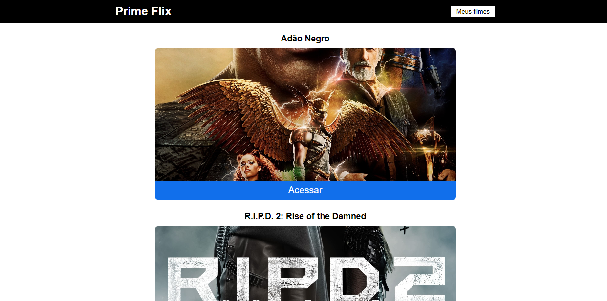

### Technologies used REACT

<h1 style="text-align: center; font-weight: bold;">PRIME FLIX</h1>

## Demo 📸

<div align="center" >
   
</div>
 ---

## Sobre o Projeto
O projeto Prime Flix foi desenvolvido através do curso Sujeito Programador, consumimos uma API externa e gratuita, no projeto listamos dez filmes que estâo em cartaz, podendo ver trailer do filme, salvar nos favoritos ou excluir e com uso de rotas. 


### Link do projeto: https://the-great-deniseschirmer-site.netlify.app/
### 🛠 Tecnologias
#### As seguintes ferramentas foram usadas na construção do projeto:

- [REACT](https://pt-br.reactjs.org/)


--- 
Antes de começar, você vai precisar ter instalado em sua máquina as seguintes ferramentas:
[Git](https://git-scm.com), [Node.js](https://nodejs.org/en/).
Além disto é bom ter um editor para trabalhar com o código como [VSCode](https://code.visualstudio.com/)

### 🎲 Rodando o projeto

```bash
# Clone este repositório
$ git clone  https://github.com/deniseschirmer/prime-flix
# Acesse a pasta do projeto no terminal/cmd

# Instale as dependências
$ yarn
# ou
$ npm install

# Execute a aplicação em modo de desenvolvimento
$ yarn dev
# ou
$ npm run dev
```


<a href="https://raw.githubusercontent.com/ARTHURPC03/Proffy-FullStack/master/github/linkedin.png">
</a>
<br />

#### Made with love by: Denise Schirmer
[See my linkedIn](https://www.linkedin.com/in/denise-s-lima-schirmer-9702661ba/)
